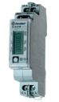

# Arduino Solar Meter
# Version 11.42
Updated software manual.
[Arduino Solar Meter Software Manual V11_42.pdf](Documentation_Arduino Solar Meter Software Manual V11_42.pdf)
# Version 11.41
Updated software manual.
[Arduino Solar Meter Software Manual V11_41.pdf](Documentation_Arduino Solar Meter Software Manual V11_41.pdf)
Updated hardware manual.
[Arduino Solar Meter Hardware Manual V11.pdf](Documentation_Arduino Solar Meter Hardware Manual V11.pdf)
# Version 11.4
* All sensors now have a total counter.
* Small delay at power up to let the network initialize after a reset.
* New method of measuring actual net power.
* Time server must be configured in userdefs.h (see userdefs_org.h)
* Definition of gassensor for Mindergas changed (see userdefs_org.h).
The software manual is updated, the hardware manual of V10 is still valid.
[Arduino Solar Meter Software Manual V11_4.pdf](Documentation_Arduino Solar Meter Software Manual V11_4.pdf)

# Version 11.31
Stability is improved and some options are configurable. The software manual is updated, the hardware manual of V10 is still valid.
[Arduino Solar Meter Software Manual V11_3.pdf](Documentation_Arduino Solar Meter Software Manual V11_3.pdf)

* Changed the way the response of websites is logged. Do not use strings anymore because they can corrupt memory since stringlength cannot be controlled.
* Fixed a bug in consumption calculation. This caused faulty Net consumption when the peak solar generation differs from the average solar generation.
* Changed the Ethernet retransmission count and delay to prevent missing uploads.
* Improved 'new hour' checking to prevent double mail generation.
* Changed Webserver port to 555
* First temperature logging is corrected
* This release does not overwrite the original userdefs.h but creates a new usedefs_org.h as a reference. 

**New features in userdefs.h:**
_#define {"USE_WD"}_
If this line is added, the watchdog is enabled. If not present the watchdog is disabled

_#{"TIME_OFFSET 0"}_
The number in this line is used to shift the clock of the arduino in seconds (positive or negative) With this parameter you can shift the time of upload to all websites to prevent all users uploading at the same time. Any integer between -150 and +150 is allowed (a larger number will work but corrupts the timestamp to pvoutput)

Configuration of exosite is done in separate _exosite.h_ file. A sample is in _{"exosite_org.h"}_

# Version 11
In this version the automatic upload to mindergas.nl is included
Also it is possible to send data to exosite.com
The response from the sites is now readable to make debugging easier.
It is possible to reset all counters to fake a new day in case the data is not valid.
The hardware documentation of version 10 is still valid.
New software documentation can be found here:
[Arduino Solar Meter Software Manual V11.pdf](Documentation_Arduino Solar Meter Software Manual V11.pdf)
# Version 10
This version adds support for reading the P1 port of a smart-meter, including gas.
Fixed some minor bugs.
Added functionality in the Status web-page.
See the documentation for details:
[Arduino Solar Meter Hardware Manual V10.pdf](Documentation_Arduino Solar Meter Hardware Manual V10.pdf)
[Arduino Solar Meter Software Manual V10.pdf](Documentation_Arduino Solar Meter Software Manual V10.pdf)
Thanks to the "wijhebbenzon" users for help on implementation and debugging.
# Version 9.1
This is a maintenance release. It fixes a bug in the ferraris sensor that prevented negative power values. Also the existing temperature value in PvOutput is not overwritten if the temperature sensor is not used.
Minor fix for linux users.
The documentation is updated and extended according to comments and problems from users.
[Arduino Solar Meter Hardware Manual V91.pdf](Documentation_Arduino Solar Meter Hardware Manual V91.pdf)
[Arduino Solar Meter Software Manual V91.pdf](Documentation_Arduino Solar Meter Software Manual V91.pdf)

# Version 9
This version is an extension of version 8.5.
Additional types of sensors can be added. 
An optical sensor can be made from a LED and a phototransistor to monitor gas or water usage.
A double optical sensor can monitor your Ferraris meter in two directions. The software uses an autocalibration routine so that even hard to detect ferraris discs can be measured.
The current temperature can be retrieved from a nearby weatherstation. The software uses the xml.buienradar.nl site for this.
If you monitor gas usage and the temperature, this software can also calculate the isolation factor of your house. The lower this factor, the less gas is needed at a certain outside temperature, the better the house is isolated.
The documentation for this version is in the next two documents:
[Arduino Solar Meter Hardware Manual.pdf](Documentation_Arduino Solar Meter Hardware Manual.pdf)
[Arduino Solar Meter Software Manual.pdf](Documentation_Arduino Solar Meter Software Manual.pdf)

# Version 8
## Hardware
The first version ran on an Arduino duemillenova. In the meantime the program is also tested on Arduino Uno and mega2560

To connect to the web and use the SD card for storage, a standard Arduino ethernetshield with W5100 chip is used. If you have a clone that also uses this chip, there is no problem. If your shield has another chip, you will need another library and probably a few changes in the program to calls to the library.

## [installing the hardware](installing-the-hardware)
# Sensors
kWh meter with S0 sensor output.

V7 supports only 1000 pulses per kWh.
V8 supports any number of pulses per kWh.
The sensor (S0+) has to be connected to digital in 2 and (S0-) to gnd.
## [installation](installation)
# Environment
Arduino IDE 1.0.2
windows 7, 32 bit
# Basic software
The software can be downloaded from the downloads tab. It is a zip file that must be extracted to a local folder. The folder name must be the same (case sensitive) as the name of the main program, in this case "Solarmeter". 
All files in the sub-folder "libraries" must be copied to the "libraries" folder of the arduino IDE.

The folder structure should look like this:
{{
Arduino-1.0.2
  Libraries
    <all standard libraries>
    FlashMini
    MSTimer2
    Pstring
    SD
    Time
  Projects
    Solarmeter
      Eeprom.ino
      Logging.ino
      PVoutput.ino
      Solar.cpp
      Solar.h
      Solarmeter.ino
      Time.ino
      Userdefs.h
      Webstuff.ino
}}
When this is correctly done, the program should compile without errors.
# [software configuration](software-configuration)
# [software description](software-description)
# [options](options)
